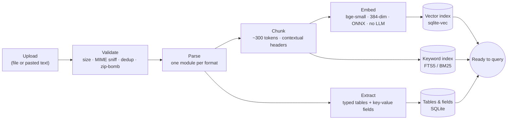
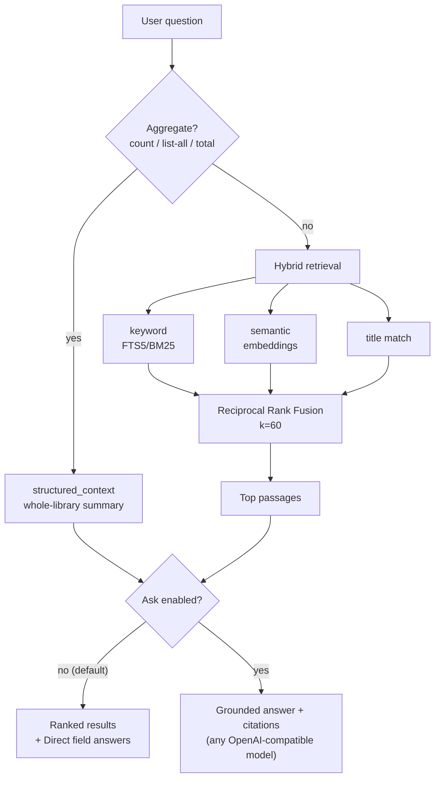

# EasyNotes

**Dump any file, find it in plain English.**

EasyNotes ingests unstructured/semi-structured documents — PDF, DOCX, PPTX,
XLSX, CSV, JSON, HTML, Markdown, plain text, or pasted notes — and turns them into **clean,
structured data you can query two ways**: precise, spreadsheet-style filters over
extracted tables & fields, or natural-language / keyword / hybrid search. It runs
as a single container, is fully self-hosted, needs **no LLM** by default (grounded
"Ask" answers are an optional add-on), and costs **nothing per query**.

> Despite the name, EasyNotes handles far more than notes — spreadsheets, slide
> decks, and PDFs all go in the same box.

## Quick start

```bash
make setup     # create the venv, install deps, bootstrap .env  (scripts/setup.sh)
make run       # run locally with hot reload → http://localhost:8000
```

On a brand-new Mac, `bash scripts/setup-mac.sh` installs Homebrew, Python 3.12 and
Docker first, then calls `make setup`. Prefer the container? `make docker-run`
builds the image **and** runs it at http://localhost:8000.

Run `make` with no target for the full list. The common ones:

| Command | What it does |
|---|---|
| **Dev** | |
| `make setup` | Create the venv, install deps, bootstrap `.env` (runs `scripts/setup.sh`) |
| `make run` | Run locally with hot reload |
| `make test` | Run the full test suite |
| `make eval` | Print retrieval quality (recall@10, MRR) per mode |
| `make lint` | Lint with ruff |
| **Docker** | |
| `make docker-run` | Build the image **and** run the container locally |
| `make docker-test` | Prove the container boots + searches with **no network** |
| `make docker-stop` | Stop the local container |
| **Release** | |
| `make docker-push` | Log in to Docker Hub and push `$DOCKER_USER/easynotes` (set `DOCKER_USER` in the Makefile) |
| `make github-push` | Push all commits to GitHub (`Gaurang135/EasyNotes`) |
| `make zip` | Package the project into `dist/easynotes.zip` for moving to another machine |

**Moving to another machine:** `make zip` produces `dist/easynotes.zip` — it excludes
`.venv/` (regenerated), `.env` (secrets), and `data/` (recreated on boot), but keeps the
full `.git` history. On the new box: `unzip easynotes.zip -d easynotes && cd easynotes &&
make setup`, then copy `.env.example` → `.env` and add your key.

## How it works (architecture)

> The diagrams below are [Mermaid](https://mermaid.js.org) — GitHub renders them inline.
> (Placeholders you can later swap for exported images.)

**Ingestion pipeline** — messy file in, clean structured data out:



**Query paths** — three retrieval modes, exact aggregates, and the optional LLM answer:



**One process, one file.** FastAPI serves the API and UI; SQLite is the only
datastore (no database server to run, **no credentials to procure** — the
"database" is just `data/easynotes.db`). Ingestion runs in a background task.

**Search modes**
- **keyword** — FTS5/BM25 with a query sanitizer; exact terms, phrases, `AND/OR`,
  plus filters (file type, document). Your "defined queries."
- **semantic** — embeds your question and finds passages by meaning. Natural
  language.
- **hybrid** (default) — fuses both with RRF (`k=60`), no tuning.

**The Data view** turns your library into structured data you can query precisely:
every CSV/XLSX/table becomes a typed table (filter/sort by column), and every
extracted key-value (vendor, amount, date, email…) is one unified, filterable
dataset across all documents.

**Durability without a server.** SQLite is embedded, so on an ephemeral host the
disk is wiped on restart. EasyNotes snapshots the DB (`VACUUM INTO`) to
S3-compatible object storage after every ingest and restores it on boot — giving
durable storage at **$0** on a free tier. Set `SNAPSHOT_BACKEND=none` (default)
for pure local use.

## Key components

| Path | Responsibility |
|---|---|
| `app/main.py` | Composition root (`create_app`) + startup self-check |
| `app/ingest/parsers/` | One parser per format, behind a registry |
| `app/ingest/chunker.py` | Token-budgeted chunking + contextual headers |
| `app/ingest/pipeline.py` | parse → chunk → embed → index orchestration |
| `app/search/embeddings.py` | fastembed embedder (query/passage split) |
| `app/search/vectors.py` | sqlite-vec index + numpy fallback (one interface) |
| `app/search/fts.py` | FTS5 keyword index + query sanitizer |
| `app/search/service.py` | Shared retrieval + field-intent router (Direct answers) |
| `app/ingest/extract.py` | Config-driven field extraction + column type inference |
| `app/api/structured.py` | Tables, fields, per-document detail, library stats |
| `app/persistence/` | Snapshot/restore backends (local / S3 / none) |

## API

| Method & path | Purpose |
|---|---|
| `POST /documents` | Upload a file (multipart) |
| `POST /documents/text` | Ingest pasted text (`{title, text}`) |
| `GET /documents` / `GET /documents/{id}` | List / status |
| `DELETE /documents/{id}` | Remove a document (and all its index rows) |
| `GET /search?q=&mode=&type=&doc_id=` | Search (+ Direct answers for field queries) |
| `GET /stats` · `GET /overview` | Library stats · per-document extracted-structure summary |
| `GET /tables` · `GET /tables/{id}/rows?col=&op=&val=&sort=` | Structured tables + typed queries |
| `GET /fields?kind=&q=` | Extracted key-value fields across all documents |
| `GET /documents/{id}/detail` · `GET /documents/{id}/download` | Extracted structure · original file |
| `POST /answer` | Grounded answer + citations (optional LLM; `501` until enabled) |
| `GET /healthz` | Health check |

Example:

```bash
curl -F "file=@report.pdf" localhost:8000/documents
curl "localhost:8000/search?q=refund%20policy&mode=hybrid"
```

## Configuration (env vars)

`DATA_DIR`, `MAX_UPLOAD_MB`, `EMBED_MODEL`, `EMBED_CACHE_DIR`, `EMBED_MODEL_PATH`,
`EMBED_THREADS` (default 1), `EMBED_BATCH_SIZE`, `INGEST_MODE` (threaded|inline), and the
snapshot block: `SNAPSHOT_BACKEND` (`none`|`local`|`s3`), `SNAPSHOT_ENDPOINT`,
`SNAPSHOT_BUCKET`, `SNAPSHOT_ACCESS_KEY`, `SNAPSHOT_SECRET_KEY`,
`SNAPSHOT_INTERVAL_S`. Optional grounded answers: `ANSWER_BASE_URL`, `ANSWER_API_KEY`,
`ANSWER_MODEL` (see the Ask section below).

## Deploying to a free tier (Render + Cloudflare R2)

Render's free web service has an ephemeral disk, so durability comes from R2
snapshots (10 GB free, free egress):

1. Create an R2 bucket and an API token (access key + secret).
2. Deploy the Docker image to Render (free web service).
3. Set: `SNAPSHOT_BACKEND=s3`, `SNAPSHOT_ENDPOINT=<your-r2-endpoint>`,
   `SNAPSHOT_BUCKET=<bucket>`, `SNAPSHOT_ACCESS_KEY`, `SNAPSHOT_SECRET_KEY`.

> **Single writer only.** This design assumes exactly one instance — never scale
> horizontally, or snapshots will race.

The same image also runs anywhere with a real disk (Render Starter + disk, an
Oracle Always-Free VM, or your own machine) with `SNAPSHOT_BACKEND=none`.

## LLM-free by default — grounded "Ask" is an optional layer

EasyNotes does the **hard, LLM-free half of RAG** — parsing, structured extraction,
and hybrid retrieval — so it's fast, private, and $0 with no model at query time. The
**generation** stage is a thin, optional layer behind `POST /answer` and the UI's
**✦ Ask** mode: it retrieves the top passages and asks a model to compose a **grounded
answer with citations**, or replies "I couldn't find that in your documents."

It's **off by default** (returns `501` with instructions). Enable it with any
OpenAI-compatible endpoint — no code change:

```bash
# Google Gemini free tier (recommended — generous free tier, good quality)
export ANSWER_BASE_URL=https://generativelanguage.googleapis.com/v1beta/openai
export ANSWER_API_KEY=your_ai_studio_key   # aistudio.google.com/apikey
export ANSWER_MODEL=gemini-3.1-flash-lite  # Flash-Lite = higher free-tier throughput; gemini-3.6-flash for best quality
make run

# …or Groq free tier
export ANSWER_BASE_URL=https://api.groq.com/openai/v1
export ANSWER_API_KEY=gsk_your_key
export ANSWER_MODEL=openai/gpt-oss-120b

# …or fully local / offline via Ollama (no key, no rate limits)
export ANSWER_BASE_URL=http://localhost:11434/v1
export ANSWER_MODEL=llama3.2
```

Also works with OpenAI (`ANSWER_BASE_URL=https://api.openai.com/v1`, `ANSWER_MODEL=gpt-5.6-luna`).
Put keys in a git-ignored `.env` (never commit them). Answers are grounded strictly in
retrieved excerpts; the retrieval path is unchanged, so turning Ask on/off never affects
search or the structured Data views. See `DECISIONS.md`.

## Development

TDD throughout (`make test`). The steel thread (upload → search) is proven
end-to-end inside the offline Docker image (`make docker-test`). Retrieval quality
is measured with `make eval`.
